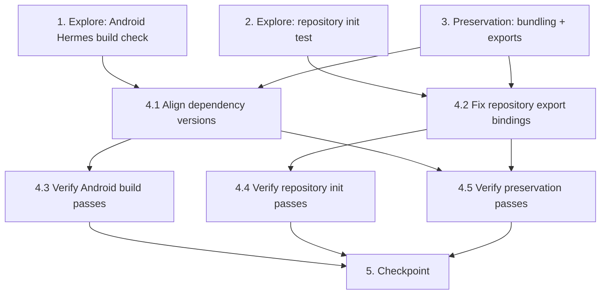

# Implementation Plan

## Overview

This plan fixes the Android build failure for the Notiver Expo app. It follows
the exploratory bugfix workflow: write failing exploration checks/tests that
demonstrate the bug on unfixed code, capture preservation baselines, apply the
fix (align dependency versions to Expo SDK 54 and correct the repository export
bindings), then re-run the same checks to validate the fix and confirm no
regressions.

## Task Dependency Graph

```json
{
  "waves": [
    { "wave": 1, "tasks": ["1", "2", "3"], "dependsOn": [] },
    { "wave": 2, "tasks": ["4.1", "4.2"], "dependsOn": ["1", "2", "3"] },
    { "wave": 3, "tasks": ["4.3", "4.4", "4.5"], "dependsOn": ["4.1", "4.2"] },
    { "wave": 4, "tasks": ["5"], "dependsOn": ["4.3", "4.4", "4.5"] }
  ]
}
```



## Tasks

- [x] 1. Write bug condition exploration check for the Android Hermes build
  - **Property 1: Bug Condition** - Android Hermes Build Succeeds
  - **CRITICAL**: This check MUST FAIL on unfixed code - failure confirms the bug exists
  - **DO NOT attempt to fix the test or the code when it fails**
  - **NOTE**: This check encodes the expected behavior - it will validate the fix when it passes after implementation
  - **GOAL**: Surface counterexamples that demonstrate the bug exists
  - **Scoped PBT Approach**: This is a deterministic build failure, so scope the property to the concrete failing case: run `npx expo export --platform android` and assert the output contains zero `private properties are not supported` errors and exits with code 0 (from Bug Condition `isBugCondition`, primary branch, in design)
  - Also run `npx expo install --check` and assert no SDK version mismatches are reported (covers Requirement 1.3 / 2.3)
  - Run the check on UNFIXED code
  - **EXPECTED OUTCOME**: Check FAILS — Hermes emits hundreds of `private properties are not supported` errors and `expo install --check` lists `babel-preset-expo 56.0.13 → ~54.0.10` (and others)
  - Document counterexamples found to confirm the babel-preset-expo root cause
  - Mark task complete when the check is written, run, and the failure is documented
  - _Requirements: 1.1, 1.2, 1.3_

- [x] 2. Write bug condition exploration test for repository singleton initialization
  - **Property 3: Bug Condition** - Repository Singletons Initialize Without ReferenceError
  - **CRITICAL**: This test MUST FAIL on unfixed code - failure confirms the bug exists
  - **DO NOT attempt to fix the test or the code when it fails**
  - **GOAL**: Surface the runtime `ReferenceError` from `src/database/repositories/index.ts`
  - **Scoped PBT Approach**: This is a deterministic runtime failure — scope the property to importing `src/database/repositories/index.ts` and asserting it loads without throwing (from Bug Condition `isBugCondition`, secondary branch, in design)
  - Run the test on UNFIXED code
  - **EXPECTED OUTCOME**: Test FAILS with `ReferenceError: NotificationRepository is not defined` (or the first re-export-only name)
  - Document the counterexample to confirm the re-export-binding root cause
  - Mark task complete when the test is written, run, and the failure is documented
  - _Requirements: 1.4_

- [x] 3. Write preservation property tests (BEFORE implementing fix)
  - **Property 2: Preservation** - Repository Exports and Bundling Unchanged
  - **IMPORTANT**: Follow observation-first methodology
  - Observe on UNFIXED code: Metro resolves and bundles all application modules successfully (the export run reaches the Hermes step, proving bundling succeeded)
  - Observe on UNFIXED code: the set of names exported from `src/database/repositories` (classes `BaseRepository`, `NotificationRepository`, `RuleRepository`, `RuleExecutionRepository`, `AnalyticsRepository`, `FocusSessionRepository`, `SettingsRepository`, `AIPredictionRepository`) is the intended public surface
  - Write a property-based test (using fast-check, already a devDependency): for all repository export names in the expected set, the module exports a defined value, and each singleton is an instance of its corresponding class (from Preservation Requirements in design)
  - **NOTE**: Some of these assertions cannot fully pass until the Property 3 fix lands because the module throws on load on unfixed code; capture the intended export surface now and confirm the names/instances after the fix. The bundling-success observation MUST be confirmed on unfixed code.
  - Run the preservation tests/observations on UNFIXED code
  - **EXPECTED OUTCOME**: Bundling-success observation PASSES on unfixed code, establishing the baseline behavior to preserve
  - Mark task complete when preservation tests are written and the baseline is documented
  - _Requirements: 3.1, 3.2, 3.3, 3.4_

- [ ] 4. Fix Android build failure (dependency alignment + repository export bindings)

  - [x] 4.1 Align dependency versions to Expo SDK 54
    - Run `npx expo install --check` to confirm the reported mismatches
    - Run `npx expo install --fix` (or explicit `npx expo install <pkg>@<expected>`) to set SDK-54-compatible versions, at minimum: `babel-preset-expo@~54.0.10` (CRITICAL), `expo-blur@~15.0.8`, `expo-linear-gradient@~15.0.8`, `@shopify/flash-list@2.0.2`, `react-native-svg@15.12.1`, `@react-navigation/native-stack@^7.3.16`, `jest@~29.7.0`
    - Reinstall dependencies so `node_modules`/lockfile use the corrected `babel-preset-expo`
    - _Bug_Condition: isBugCondition(input) primary branch — androidExport with babelPresetExpoMajorVersion <> expoSdkMajorVersion_
    - _Expected_Behavior: expectedBehavior(result) — Hermes compiles with zero `private properties are not supported` errors; `expo install --check` reports compatible_
    - _Preservation: Preservation Requirements from design — Metro bundling and dev/web behavior unchanged_
    - _Requirements: 2.1, 2.2, 2.3, 3.1, 3.3, 3.4_

  - [x] 4.2 Fix repository index export bindings
    - In `src/database/repositories/index.ts`, add `import { X } from './x.repository'` statements for each class used to construct a singleton (`NotificationRepository`, `RuleRepository`, `RuleExecutionRepository`, `AnalyticsRepository`, `FocusSessionRepository`, `SettingsRepository`, `AIPredictionRepository`)
    - Re-export the imported names (import-then-export) so they exist as local bindings; keep `BaseRepository` and all singleton declarations and their exported names unchanged
    - _Bug_Condition: isBugCondition(input) secondary branch — moduleLoad of repositories/index.ts with re-export-only names_
    - _Expected_Behavior: expectedBehavior(result) — singletons instantiate without ReferenceError; same classes/instances exported_
    - _Preservation: Preservation Requirements from design — exported names and equivalent instances unchanged_
    - _Requirements: 2.4, 3.2_

  - [ ] 4.3 Verify Android Hermes build exploration check now passes
    - **Property 1: Expected Behavior** - Android Hermes Build Succeeds
    - **IMPORTANT**: Re-run the SAME check from task 1 - do NOT write a new check
    - Run `npx expo export --platform android` and `npx expo install --check`
    - **EXPECTED OUTCOME**: Hermes compilation completes with zero `private properties are not supported` errors and exit code 0; `expo install --check` reports all dependencies compatible
    - _Requirements: 2.1, 2.2, 2.3_

  - [ ] 4.4 Verify repository initialization exploration test now passes
    - **Property 3: Expected Behavior** - Repository Singletons Initialize Without ReferenceError
    - **IMPORTANT**: Re-run the SAME test from task 2 - do NOT write a new test
    - **EXPECTED OUTCOME**: Importing `src/database/repositories/index.ts` loads without `ReferenceError`
    - _Requirements: 2.4_

  - [ ] 4.5 Verify preservation tests still pass
    - **Property 2: Preservation** - Repository Exports and Bundling Unchanged
    - **IMPORTANT**: Re-run the SAME tests from task 3 - do NOT write new tests
    - Confirm Metro still bundles all modules, and every expected export name/instance is present after the fix
    - **EXPECTED OUTCOME**: Tests PASS (confirms no regressions)
    - _Requirements: 3.1, 3.2, 3.3, 3.4_

- [ ] 5. Checkpoint - Ensure all tests pass
  - Ensure the Android export completes cleanly, the repository module loads, and preservation tests pass; ask the user if questions arise
  - Note: TypeScript errors in `*.test.ts` / `*.property.test.ts` from the jest version mismatch are out-of-scope for the Android build; aligning `jest` to `~29.7.0` in task 4.1 is expected to resolve them as a follow-up

## Notes

- **Exploration before fix**: Tasks 1 and 2 must be written and run on the
  UNFIXED code first. They are expected to FAIL — that failure confirms the bug.
  Do not attempt to fix the code while writing these checks.
- **Run on unfixed code**: The Android Hermes build check (task 1) and the
  repository init test (task 2) reproduce the two root causes (mismatched
  `babel-preset-expo` and the re-export-binding defect). Observe the failures to
  confirm the root cause before changing any code.
- **Observation-first preservation**: Task 3 captures the baseline (successful
  Metro bundling, intended repository export surface) on the unfixed code so the
  fix can be verified not to regress it.
- **Critical dependency**: `babel-preset-expo@~54.0.10` is the key version — it
  restores private-class-field transpilation so Hermes (SDK 54) receives
  compatible output.
- **Out of scope**: Jest 30-vs-29 TypeScript errors in test files are not bundled
  by Metro and do not affect the Android build; they are a follow-up.
