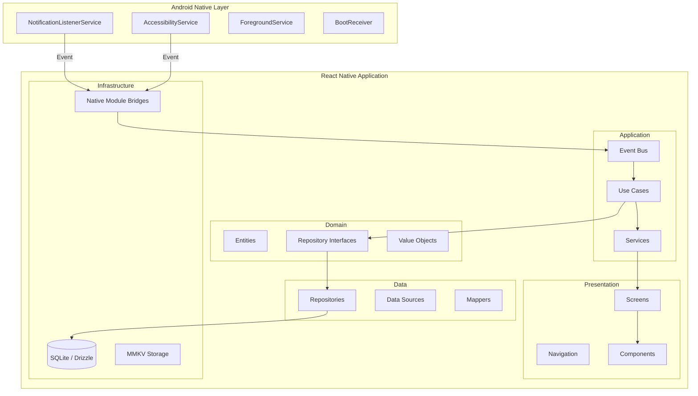
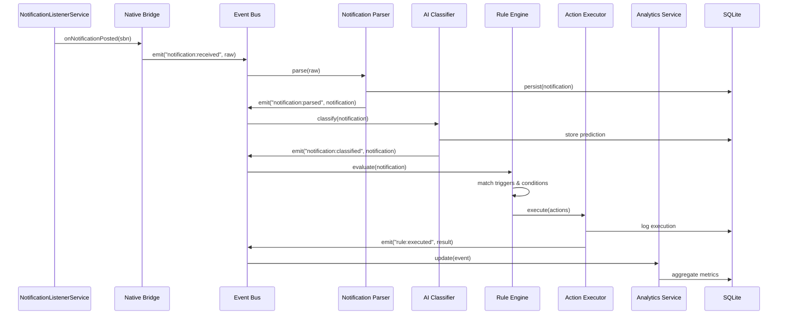
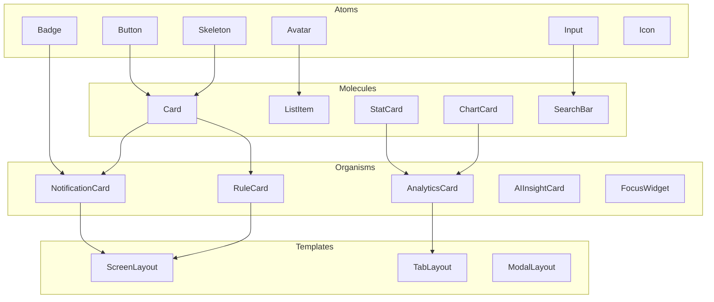
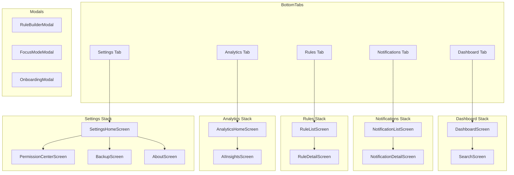

# Design Document

## Overview

The Notification Intelligence Platform is an Android-only React Native application built on Expo (bare workflow via expo-dev-client) that captures, classifies, and automates notification management. The system uses an event-driven pipeline: notifications are captured by a native Android service, parsed, classified by an AI keyword engine, evaluated against user-defined rules, and actions are executed — all while persisting data locally for analytics and history.

The architecture follows Clean Architecture with five layers (Presentation → Application → Domain → Data → Infrastructure) organized into feature-based modules. The app is offline-first with SQLite as the primary data store, uses Zustand for client state, TanStack Query for async/database state, and communicates across features via an event bus.

Key technical decisions:
- **expo-dev-client** for native module access (NotificationListenerService, AccessibilityService)
- **NativeWind** (Tailwind CSS) for styling with a custom dark theme
- **Drizzle ORM** over SQLite for type-safe queries and migrations
- **Feature isolation** — modules communicate only via event bus or shared service interfaces

## Architecture

### System Architecture



### Event-Driven Notification Pipeline



### Layer Responsibilities

| Layer | Responsibility | Key Modules |
|-------|---------------|-------------|
| Presentation | UI rendering, navigation, user input | Screens, Components, Navigation, Theme |
| Application | Orchestration, use cases, business flows | Services, Use Cases, Event Bus |
| Domain | Business rules, entities, interfaces | Entities, Repository Interfaces, Value Objects |
| Data | Persistence, caching, data mapping | Repositories, Data Sources, Mappers |
| Infrastructure | Platform integration, native bridges | SQLite, MMKV, Native Modules |

## Components and Interfaces

### Folder Structure

```
src/
├── app/                    # App entry, providers, root layout
├── core/                   # Base classes, constants, error types
│   ├── errors/
│   ├── constants/
│   └── base/
├── shared/                 # Shared components, hooks, utils
│   ├── components/
│   │   ├── atoms/         # Button, Input, Badge, Avatar, Skeleton
│   │   ├── molecules/     # Card, ListItem, StatCard, ChartCard
│   │   ├── organisms/     # NotificationCard, RuleCard, AnalyticsCard
│   │   └── templates/     # ScreenLayout, TabLayout, ModalLayout
│   ├── hooks/
│   └── utils/
├── features/
│   ├── dashboard/         # Dashboard screens, widgets, stores
│   │   ├── screens/
│   │   ├── components/
│   │   ├── hooks/
│   │   └── store/
│   ├── notifications/     # Notification history, details, search
│   │   ├── screens/
│   │   ├── components/
│   │   ├── hooks/
│   │   └── store/
│   ├── rules/             # Rule engine, builder, list, templates
│   │   ├── screens/
│   │   ├── components/
│   │   ├── hooks/
│   │   ├── store/
│   │   └── engine/        # Rule evaluation logic
│   ├── analytics/         # Analytics screens, charts, service
│   │   ├── screens/
│   │   ├── components/
│   │   ├── hooks/
│   │   └── service/
│   ├── focus/             # Focus mode screens, engine, presets
│   │   ├── screens/
│   │   ├── components/
│   │   ├── hooks/
│   │   ├── store/
│   │   └── engine/
│   ├── settings/          # Settings screens, backup/restore
│   │   ├── screens/
│   │   └── components/
│   ├── ai/                # AI classification, insights
│   │   ├── screens/
│   │   ├── components/
│   │   └── engine/        # Keyword classifier logic
│   ├── onboarding/        # Onboarding flow, permission center
│   │   ├── screens/
│   │   └── components/
│   └── auth/              # Future auth module placeholder
├── database/              # SQLite setup, migrations, repositories
│   ├── schema/            # Drizzle table definitions
│   ├── migrations/        # Incremental migration files
│   ├── repositories/      # Repository implementations
│   └── seed/              # Default data seeding
├── services/              # Application services
│   ├── event-bus/         # Event bus implementation
│   ├── notification/      # Notification processing service
│   ├── analytics/         # Analytics aggregation service
│   └── backup/            # Export/import service
├── navigation/            # Navigation configuration
│   ├── bottom-tabs.tsx
│   ├── stacks/
│   └── modals/
├── native/                # Native module bridges (Android)
│   ├── notification-listener/
│   ├── accessibility/
│   ├── foreground-service/
│   └── boot-receiver/
├── theme/                 # Design tokens, theme provider
│   ├── tokens.ts
│   ├── provider.tsx
│   └── nativewind.config.ts
├── types/                 # Global TypeScript types
└── config/                # App configuration, feature flags
```

### Key Interfaces

```typescript
// Event Bus Interface
interface IEventBus {
  emit<T>(event: string, payload: T): void;
  on<T>(event: string, handler: (payload: T) => void): () => void;
  off(event: string, handler: Function): void;
}

// Repository Interface (per entity)
interface IRepository<T, ID = string> {
  findById(id: ID): Promise<T | null>;
  findAll(options?: QueryOptions): Promise<T[]>;
  create(entity: Omit<T, 'id' | 'createdAt'>): Promise<T>;
  update(id: ID, partial: Partial<T>): Promise<T>;
  delete(id: ID): Promise<void>;
  count(filter?: FilterOptions): Promise<number>;
}

// Notification Repository (extends base)
interface INotificationRepository extends IRepository<Notification> {
  findByApp(packageName: string, options?: QueryOptions): Promise<Notification[]>;
  findByCategory(category: NotificationCategory, options?: QueryOptions): Promise<Notification[]>;
  findByDateRange(start: Date, end: Date): Promise<Notification[]>;
  search(query: string, options?: QueryOptions): Promise<Notification[]>;
  batchInsert(notifications: Notification[]): Promise<void>;
}

// Rule Engine Interface
interface IRuleEngine {
  evaluate(notification: Notification): Promise<RuleExecutionResult[]>;
  registerTrigger(type: TriggerType, handler: TriggerHandler): void;
  registerCondition(type: ConditionType, evaluator: ConditionEvaluator): void;
  registerAction(type: ActionType, executor: ActionExecutor): void;
}

// AI Classifier Interface
interface IAIClassifier {
  classify(notification: Notification): Promise<ClassificationResult>;
  updateKeywords(category: NotificationCategory, keywords: string[]): Promise<void>;
  getKeywordDictionary(): Promise<KeywordDictionary>;
}

// Focus Engine Interface
interface IFocusEngine {
  startSession(preset: FocusPreset, config: FocusConfig): Promise<FocusSession>;
  pauseSession(sessionId: string): Promise<void>;
  resumeSession(sessionId: string): Promise<void>;
  endSession(sessionId: string): Promise<FocusSessionResult>;
  isBlocked(packageName: string): boolean;
}

// Analytics Service Interface
interface IAnalyticsService {
  getMetrics(period: TimePeriod): Promise<AnalyticsMetrics>;
  getNotificationTrend(period: TimePeriod): Promise<TrendData[]>;
  getTopApps(period: TimePeriod, limit: number): Promise<AppStats[]>;
  getProductivityScore(period: TimePeriod): Promise<number>;
  getFocusScore(period: TimePeriod): Promise<number>;
  incrementalUpdate(event: AnalyticsEvent): Promise<void>;
}

// Native Module Bridge Interface
interface INotificationListenerBridge {
  isRunning(): Promise<boolean>;
  requestRestart(): Promise<void>;
  onNotificationReceived(handler: (raw: RawNotification) => void): () => void;
}

interface IAccessibilityBridge {
  isEnabled(): Promise<boolean>;
  dismissNotification(key: string): Promise<boolean>;
  clickAction(key: string, actionIndex: number): Promise<boolean>;
  expandNotification(key: string): Promise<boolean>;
  autoReply(key: string, text: string): Promise<boolean>;
}
```

### Component Architecture (Atomic Design)



### State Management Architecture

```typescript
// Per-feature Zustand store pattern
interface NotificationStore {
  filters: NotificationFilters;
  selectedId: string | null;
  setFilters: (filters: Partial<NotificationFilters>) => void;
  setSelected: (id: string | null) => void;
  clearFilters: () => void;
}

// TanStack Query for database queries
// Treats local SQLite as the "server"
const useNotifications = (filters: NotificationFilters) =>
  useQuery({
    queryKey: ['notifications', filters],
    queryFn: () => notificationRepository.findAll(filters),
  });

// Event bus for cross-feature communication
// Example: notification received → rule engine → analytics update
eventBus.on('notification:classified', (notification) => {
  queryClient.invalidateQueries({ queryKey: ['notifications'] });
  queryClient.invalidateQueries({ queryKey: ['analytics'] });
});
```

## Data Models

### Database Schema (Drizzle ORM)

```typescript
// notifications table
const notifications = sqliteTable('notifications', {
  id: text('id').primaryKey(),
  packageName: text('package_name').notNull(),
  appName: text('app_name').notNull(),
  title: text('title'),
  content: text('content'),
  sender: text('sender'),
  category: text('category').$type<NotificationCategory>(),
  priority: integer('priority').default(0),
  isRead: integer('is_read', { mode: 'boolean' }).default(false),
  isArchived: integer('is_archived', { mode: 'boolean' }).default(false),
  rawData: text('raw_data'), // JSON blob of full notification data
  receivedAt: integer('received_at', { mode: 'timestamp' }).notNull(),
  createdAt: integer('created_at', { mode: 'timestamp' }).notNull(),
}, (table) => ({
  categoryIdx: index('idx_notifications_category').on(table.category),
  packageIdx: index('idx_notifications_package').on(table.packageName),
  receivedAtIdx: index('idx_notifications_received_at').on(table.receivedAt),
  appCategoryIdx: index('idx_notifications_app_category').on(table.packageName, table.category),
}));

// rules table
const rules = sqliteTable('rules', {
  id: text('id').primaryKey(),
  name: text('name').notNull(),
  description: text('description'),
  triggerType: text('trigger_type').$type<TriggerType>().notNull(),
  triggerConfig: text('trigger_config').notNull(), // JSON
  isActive: integer('is_active', { mode: 'boolean' }).default(true),
  priority: integer('priority').default(0),
  executionCount: integer('execution_count').default(0),
  lastTriggeredAt: integer('last_triggered_at', { mode: 'timestamp' }),
  createdAt: integer('created_at', { mode: 'timestamp' }).notNull(),
  updatedAt: integer('updated_at', { mode: 'timestamp' }).notNull(),
});

// rule_conditions table
const ruleConditions = sqliteTable('rule_conditions', {
  id: text('id').primaryKey(),
  ruleId: text('rule_id').notNull().references(() => rules.id, { onDelete: 'cascade' }),
  type: text('type').$type<ConditionType>().notNull(),
  config: text('config').notNull(), // JSON: { operator, value, field }
  logicOperator: text('logic_operator').$type<'AND' | 'OR'>().default('AND'),
  orderIndex: integer('order_index').default(0),
});

// rule_actions table
const ruleActions = sqliteTable('rule_actions', {
  id: text('id').primaryKey(),
  ruleId: text('rule_id').notNull().references(() => rules.id, { onDelete: 'cascade' }),
  type: text('type').$type<ActionType>().notNull(),
  config: text('config').notNull(), // JSON: action-specific configuration
  orderIndex: integer('order_index').default(0),
});

// rule_executions table
const ruleExecutions = sqliteTable('rule_executions', {
  id: text('id').primaryKey(),
  ruleId: text('rule_id').notNull().references(() => rules.id),
  notificationId: text('notification_id').references(() => notifications.id),
  status: text('status').$type<'success' | 'partial' | 'failed'>().notNull(),
  actionsExecuted: text('actions_executed').notNull(), // JSON array
  errorDetails: text('error_details'),
  durationMs: integer('duration_ms'),
  executedAt: integer('executed_at', { mode: 'timestamp' }).notNull(),
}, (table) => ({
  ruleIdx: index('idx_executions_rule').on(table.ruleId),
  executedAtIdx: index('idx_executions_executed_at').on(table.executedAt),
}));

// analytics table (pre-aggregated metrics)
const analytics = sqliteTable('analytics', {
  id: text('id').primaryKey(),
  date: text('date').notNull(), // YYYY-MM-DD
  hour: integer('hour'), // 0-23, null for daily aggregates
  notificationCount: integer('notification_count').default(0),
  ruleTriggeredCount: integer('rule_triggered_count').default(0),
  focusMinutes: integer('focus_minutes').default(0),
  distractionCount: integer('distraction_count').default(0),
  topApps: text('top_apps'), // JSON: [{ packageName, count }]
  categoryBreakdown: text('category_breakdown'), // JSON: { category: count }
}, (table) => ({
  dateIdx: index('idx_analytics_date').on(table.date),
  dateHourIdx: index('idx_analytics_date_hour').on(table.date, table.hour),
}));

// focus_sessions table
const focusSessions = sqliteTable('focus_sessions', {
  id: text('id').primaryKey(),
  preset: text('preset').$type<FocusPreset>().notNull(),
  status: text('status').$type<'active' | 'paused' | 'completed' | 'cancelled'>().notNull(),
  startedAt: integer('started_at', { mode: 'timestamp' }).notNull(),
  endedAt: integer('ended_at', { mode: 'timestamp' }),
  plannedDurationMin: integer('planned_duration_min').notNull(),
  actualDurationMin: integer('actual_duration_min'),
  blockedCount: integer('blocked_count').default(0),
  interruptionCount: integer('interruption_count').default(0),
  blockedApps: text('blocked_apps'), // JSON array of package names
  allowedApps: text('allowed_apps'), // JSON array of package names
});

// settings table (key-value)
const settings = sqliteTable('settings', {
  key: text('key').primaryKey(),
  value: text('value').notNull(),
  updatedAt: integer('updated_at', { mode: 'timestamp' }).notNull(),
});

// ai_predictions table
const aiPredictions = sqliteTable('ai_predictions', {
  id: text('id').primaryKey(),
  notificationId: text('notification_id').notNull().references(() => notifications.id),
  predictedCategory: text('predicted_category').$type<NotificationCategory>().notNull(),
  confidence: real('confidence').notNull(), // 0.0 - 1.0
  matchedKeywords: text('matched_keywords'), // JSON array
  createdAt: integer('created_at', { mode: 'timestamp' }).notNull(),
}, (table) => ({
  notificationIdx: index('idx_predictions_notification').on(table.notificationId),
}));
```

### Domain Entities (TypeScript Types)

```typescript
type NotificationCategory = 'important' | 'work' | 'social' | 'spam' | 'promotion' | 'emergency';
type TriggerType = 'app' | 'keyword' | 'contact' | 'time' | 'location' | 'frequency';
type ConditionType = 'contains' | 'not_contains' | 'regex' | 'category' | 'priority' | 'time_window';
type ActionType = 'dismiss' | 'delay' | 'alarm' | 'vibrate' | 'reply' | 'launch_app' | 'batch' | 'webhook' | 'copy' | 'speak';
type FocusPreset = 'study' | 'work' | 'sleep' | 'meeting' | 'custom';

interface Notification {
  id: string;
  packageName: string;
  appName: string;
  title: string | null;
  content: string | null;
  sender: string | null;
  category: NotificationCategory | null;
  priority: number;
  isRead: boolean;
  isArchived: boolean;
  rawData: Record<string, unknown> | null;
  receivedAt: Date;
  createdAt: Date;
}

interface Rule {
  id: string;
  name: string;
  description: string | null;
  triggerType: TriggerType;
  triggerConfig: Record<string, unknown>;
  conditions: RuleCondition[];
  actions: RuleAction[];
  isActive: boolean;
  priority: number;
  executionCount: number;
  lastTriggeredAt: Date | null;
  createdAt: Date;
  updatedAt: Date;
}

interface RuleCondition {
  id: string;
  ruleId: string;
  type: ConditionType;
  config: { operator: string; value: string; field?: string };
  logicOperator: 'AND' | 'OR';
  orderIndex: number;
}

interface RuleAction {
  id: string;
  ruleId: string;
  type: ActionType;
  config: Record<string, unknown>;
  orderIndex: number;
}

interface RuleExecutionResult {
  ruleId: string;
  notificationId: string;
  status: 'success' | 'partial' | 'failed';
  actionsExecuted: { type: ActionType; success: boolean; error?: string }[];
  durationMs: number;
  executedAt: Date;
}

interface FocusSession {
  id: string;
  preset: FocusPreset;
  status: 'active' | 'paused' | 'completed' | 'cancelled';
  startedAt: Date;
  endedAt: Date | null;
  plannedDurationMin: number;
  actualDurationMin: number | null;
  blockedCount: number;
  interruptionCount: number;
  blockedApps: string[];
  allowedApps: string[];
}

interface ClassificationResult {
  category: NotificationCategory;
  confidence: number;
  matchedKeywords: string[];
}

interface AnalyticsMetrics {
  notificationCount: number;
  ruleTriggeredCount: number;
  focusMinutes: number;
  distractionCount: number;
  productivityScore: number; // 0-100
  focusScore: number; // 0-100
  topApps: { packageName: string; appName: string; count: number }[];
  categoryBreakdown: Record<NotificationCategory, number>;
}
```

### Navigation Structure




## Correctness Properties

*A property is a characteristic or behavior that should hold true across all valid executions of a system — essentially, a formal statement about what the system should do. Properties serve as the bridge between human-readable specifications and machine-verifiable correctness guarantees.*

### Property 1: Repository CRUD Round-Trip

*For any* valid entity (notification, rule, focus session, setting, or AI prediction), creating it via the repository and then reading it back by ID should produce an equivalent entity with all fields preserved.

**Validates: Requirements 4.3, 5.3**

### Property 2: Notification Parsing Extracts All Fields

*For any* raw notification payload containing package name, app name, title, content, sender, timestamp, and priority fields, parsing the payload should produce a Notification entity with all specified fields correctly extracted and typed.

**Validates: Requirements 5.2**

### Property 3: Notification Filtering Correctness

*For any* set of notifications and any combination of filters (category, app, date range, priority, read status), all returned notifications must satisfy every applied filter criterion, and no notification satisfying all criteria should be excluded.

**Validates: Requirements 7.2**

### Property 4: Notification Search Matches Correct Fields

*For any* search query string and set of notifications, all returned results must contain the query string (case-insensitive) in at least one of: title, content, sender, or app name. No notification containing the query in any of those fields should be excluded.

**Validates: Requirements 7.5**

### Property 5: Rule Evaluation Executes Matching Actions in Sequence

*For any* notification and set of active rules, when a rule's trigger matches and all conditions evaluate to true, the rule's actions should execute in their defined orderIndex sequence, and the execution result should be logged.

**Validates: Requirements 8.5**

### Property 6: Failed Action Does Not Block Remaining Actions

*For any* rule with multiple actions where one action fails during execution, all subsequent actions in the sequence should still be attempted, and the failure should be logged with error details while the overall status is marked as 'partial'.

**Validates: Requirements 8.6**

### Property 7: Rule Execution History Completeness

*For any* rule execution (successful or failed), the persisted execution record must contain: rule ID, notification ID, timestamp, list of actions executed with individual success/failure status, overall status, and execution duration in milliseconds.

**Validates: Requirements 8.7**

### Property 8: Condition Logic Boolean Evaluation

*For any* set of rule conditions with AND/OR logic operators and any notification, the combined evaluation result must follow standard boolean logic: AND requires all conditions true, OR requires at least one condition true, evaluated in orderIndex sequence respecting operator precedence.

**Validates: Requirements 9.3**

### Property 9: Rule Validation Accepts Valid and Rejects Invalid

*For any* rule configuration, if all required fields are present and valid (non-empty name, valid trigger type with config, at least one action), validation should pass and the rule should persist. For any configuration missing required fields or containing invalid values, validation should reject and no data should be persisted.

**Validates: Requirements 9.6**

### Property 10: Focus Session State Machine Transitions

*For any* focus session in a given state, only valid state transitions should be allowed: active → paused, active → completed/cancelled, paused → active (resume), paused → completed/cancelled. Any invalid transition attempt should be rejected without modifying the session state.

**Validates: Requirements 11.4**

### Property 11: Focus Mode Notification Blocking

*For any* active focus session with a defined blocked apps list, notifications from apps in the blocked list should be suppressed, and notifications from apps not in the blocked list (or in the allowed list) should pass through unaffected.

**Validates: Requirements 11.2**

### Property 12: Analytics Aggregation Time-Boundary Correctness

*For any* selected time period (day, week, month, year) and set of notification/event records, the aggregated metrics should include only records whose timestamps fall within the period boundaries (inclusive start, exclusive end), and no records outside the boundary should be counted.

**Validates: Requirements 12.4**

### Property 13: Analytics Incremental Update Consistency

*For any* sequence of notification events processed incrementally, the resulting analytics metrics should be equivalent to a full recalculation from the complete event history. Incremental updates must be idempotent — processing the same event twice should not double-count.

**Validates: Requirements 12.5**

### Property 14: AI Classification Produces Valid Category

*For any* notification content (including empty, whitespace-only, special characters, and very long strings) and any keyword dictionary configuration, the AI classifier must return exactly one category from the valid set: Important, Work, Social, Spam, Promotion, or Emergency — never null, undefined, or an invalid value.

**Validates: Requirements 13.1**

### Property 15: Keyword Dictionary Update Round-Trip

*For any* valid keyword dictionary update (adding keywords to a category, removing keywords, replacing the dictionary), reading the dictionary back should reflect exactly the changes made, with no unintended modifications to other categories.

**Validates: Requirements 13.2**

### Property 16: Export/Import Database Round-Trip

*For any* database state containing notifications, rules, focus sessions, analytics, and settings, exporting to a backup file and importing into a fresh database should produce a state equivalent to the original, with all records and relationships preserved.

**Validates: Requirements 14.3, 14.4**

### Property 17: Invalid Import Leaves Database Unchanged

*For any* corrupted or invalid backup file (truncated, malformed JSON, wrong schema version, missing required tables), attempting an import should fail gracefully and the database state should remain identical to its state before the import attempt.

**Validates: Requirements 14.5**

## Error Handling

### Error Handling Strategy

The application uses a layered error handling approach:

| Layer | Strategy | Example |
|-------|----------|---------|
| Presentation | Error boundaries per feature, toast notifications | Component crash → fallback UI |
| Application | Try/catch in use cases, error events on bus | Service failure → user notification |
| Domain | Result types (success/failure), validation errors | Invalid rule config → validation error |
| Data | Repository error wrapping, retry logic | DB write failure → retry + log |
| Infrastructure | Native module error bridging, crash reporting | Native crash → JS error event |

### Error Types

```typescript
// Base error hierarchy
abstract class AppError extends Error {
  abstract readonly code: string;
  abstract readonly isRecoverable: boolean;
}

class DatabaseError extends AppError {
  code = 'DATABASE_ERROR';
  isRecoverable = true;
}

class ValidationError extends AppError {
  code = 'VALIDATION_ERROR';
  isRecoverable = true;
  constructor(public readonly fields: Record<string, string>) { super(); }
}

class NativeModuleError extends AppError {
  code = 'NATIVE_MODULE_ERROR';
  isRecoverable = false;
}

class RuleExecutionError extends AppError {
  code = 'RULE_EXECUTION_ERROR';
  isRecoverable = true;
  constructor(
    public readonly ruleId: string,
    public readonly actionType: ActionType,
    public readonly cause: Error
  ) { super(); }
}

class ImportError extends AppError {
  code = 'IMPORT_ERROR';
  isRecoverable = true;
  constructor(public readonly reason: 'corrupted' | 'invalid_schema' | 'version_mismatch') { super(); }
}
```

### Error Recovery Patterns

1. **Notification Capture Failure**: If NotificationListenerService disconnects, display persistent warning banner and offer restart via settings deep link.

2. **Rule Action Failure**: Log error, continue executing remaining actions, mark execution as 'partial'. Retry accessibility actions up to 3 times with exponential backoff (100ms, 400ms, 1600ms).

3. **Database Write Failure**: Retry up to 3 times with 50ms delay. If persistent, queue write for later processing and notify user.

4. **Import/Export Failure**: Wrap entire import in a transaction. On any error, rollback completely. Display specific error message (corrupted file, schema mismatch, etc.).

5. **Analytics Calculation Failure**: Fall back to cached/stale metrics with a "last updated" indicator. Retry calculation on next app foreground.

### Error Boundaries

Each feature module has its own React Error Boundary that:
- Catches rendering errors within the feature
- Displays a feature-specific fallback UI
- Logs the error for debugging
- Offers a "Retry" action that remounts the component tree

## Testing Strategy

### Testing Approach

The project uses a dual testing strategy combining property-based tests for universal correctness guarantees with example-based unit tests for specific scenarios and edge cases.

### Property-Based Testing

**Library**: [fast-check](https://github.com/dubzzz/fast-check) (TypeScript PBT library)

**Configuration**:
- Minimum 100 iterations per property test
- Each test tagged with: `Feature: notification-intelligence-platform, Property {N}: {title}`
- Custom arbitraries for domain entities (Notification, Rule, FocusSession, etc.)

**Coverage**:
- Repository CRUD operations (round-trip)
- Notification parsing and field extraction
- Notification filtering and search logic
- Rule engine evaluation (trigger matching, condition logic, action sequencing)
- Rule validation (accept valid, reject invalid)
- Focus session state machine transitions
- Focus mode notification blocking logic
- Analytics aggregation and incremental updates
- AI classification (valid output guarantee)
- Keyword dictionary management
- Export/import round-trip and corruption handling

### Unit Testing (Example-Based)

**Library**: Jest + React Native Testing Library

**Coverage**:
- Design system components render correctly
- Onboarding flow page sequence
- Permission center status display and deep linking
- Dashboard widget rendering with mock data
- Navigation structure (tabs, stacks, modals)
- Settings sections render
- Empty states and error states
- Specific edge cases: empty notifications, maximum rule count, zero-duration focus sessions

### Integration Testing

**Coverage**:
- Database migration applies without data loss
- Seed data populates correctly on fresh install
- Native module bridge communication (mocked native layer)
- Event bus message delivery across features
- Performance benchmarks (notification processing <100ms, rule evaluation <50ms)

### Test Organization

```
__tests__/
├── properties/           # Property-based tests (fast-check)
│   ├── repository.property.test.ts
│   ├── notification-parser.property.test.ts
│   ├── notification-filter.property.test.ts
│   ├── notification-search.property.test.ts
│   ├── rule-engine.property.test.ts
│   ├── rule-validation.property.test.ts
│   ├── focus-engine.property.test.ts
│   ├── analytics.property.test.ts
│   ├── ai-classifier.property.test.ts
│   └── backup.property.test.ts
├── unit/                 # Example-based unit tests
│   ├── components/
│   ├── services/
│   ├── hooks/
│   └── utils/
├── integration/          # Integration tests
│   ├── database/
│   ├── native-bridge/
│   └── event-bus/
└── arbitraries/          # Custom fast-check arbitraries
    ├── notification.arbitrary.ts
    ├── rule.arbitrary.ts
    ├── focus-session.arbitrary.ts
    └── analytics.arbitrary.ts
```

### Custom Arbitraries (fast-check)

```typescript
// Example: Notification arbitrary
const notificationArbitrary = fc.record({
  id: fc.uuid(),
  packageName: fc.stringOf(fc.constantFrom(...'abcdefghijklmnopqrstuvwxyz.'.split('')), { minLength: 5, maxLength: 50 }),
  appName: fc.string({ minLength: 1, maxLength: 30 }),
  title: fc.option(fc.string({ minLength: 0, maxLength: 200 })),
  content: fc.option(fc.string({ minLength: 0, maxLength: 1000 })),
  sender: fc.option(fc.string({ minLength: 1, maxLength: 50 })),
  category: fc.option(fc.constantFrom('important', 'work', 'social', 'spam', 'promotion', 'emergency')),
  priority: fc.integer({ min: -2, max: 2 }),
  isRead: fc.boolean(),
  isArchived: fc.boolean(),
  receivedAt: fc.date({ min: new Date('2024-01-01'), max: new Date('2025-12-31') }),
  createdAt: fc.date({ min: new Date('2024-01-01'), max: new Date('2025-12-31') }),
});

// Example: Rule arbitrary
const ruleArbitrary = fc.record({
  id: fc.uuid(),
  name: fc.string({ minLength: 1, maxLength: 100 }),
  triggerType: fc.constantFrom('app', 'keyword', 'contact', 'time', 'location', 'frequency'),
  conditions: fc.array(conditionArbitrary, { minLength: 0, maxLength: 5 }),
  actions: fc.array(actionArbitrary, { minLength: 1, maxLength: 5 }),
  isActive: fc.boolean(),
  priority: fc.integer({ min: 0, max: 100 }),
});
```

### Performance Testing

- Notification processing pipeline: end-to-end <100ms (capture → parse → store → emit)
- Rule evaluation: <50ms for up to 100 active rules
- App launch to interactive: <2 seconds
- Memory usage: <200MB during typical operation
- FlashList rendering: 60fps with 10,000+ notifications
